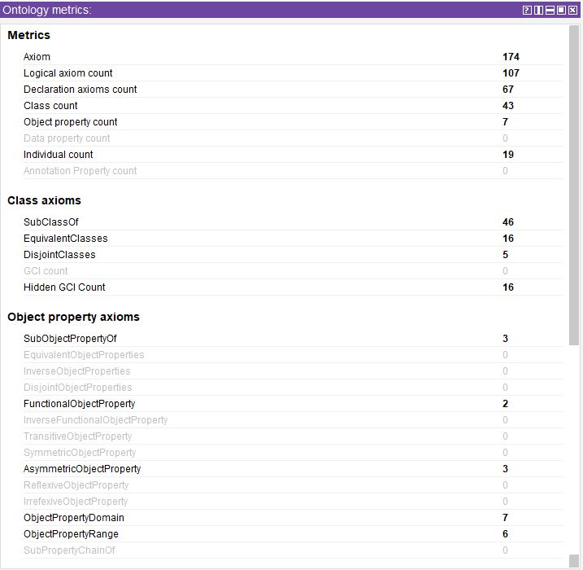
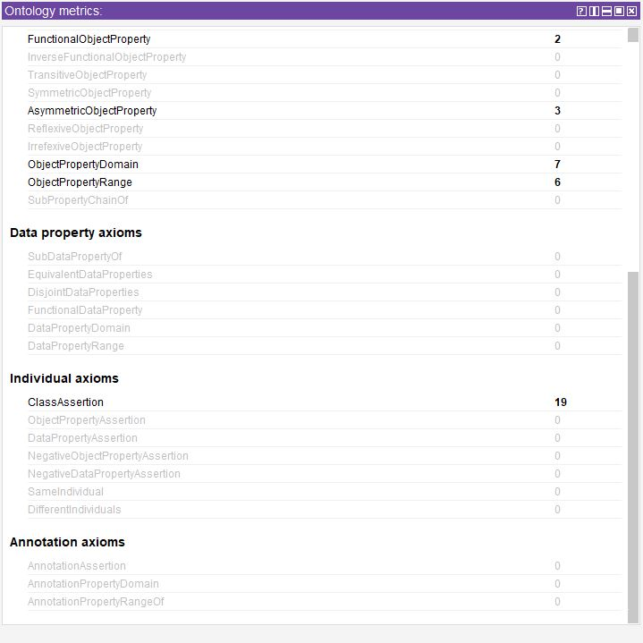

# IA301_SymbolicAI_Ontologies

Developing ontology about sustainable cities and Human Settlements SDG GOAL11

------------------------------- **Sustainable Cities Ontology** -------------------------------
> “make  cities  and  human  settlements  inclusive,  safe-resilient  and  sustainable.” 

##  Motivation

Cities are growing with unseen rate, providing better living conditions at the cost of nature. Which rises the worry, therefore many association are devoted for the aim to provide suitable plans for goverments to create smart, sustainable cities. One of them, is the Agenda2030 published by the UN containing 17 objectives. My team decided to work on GOAL11 "Make  cities  and  human  settlements  inclusive,  safe,resilient  and  sustainable.” Throughtout, this project we would like to build an ontology which is a recommendation model to help urban planning.

----

## Objective:  
 
A recommendation model to help urban planning and ensure sustainability of cities and human settlements.
 
### Team:

- Sini SURESH
- Imad Eddine MAROUF
- Anne-Claire MARECHAL

### Methodology:

|**Objective**| An ontology for the sustainable cities knowledge domain, in order to help urban planning |

|**Main classes**| Sustainibility, Regions, and Population |

|**Basic property**| Defining the basic relationships between classes and how they interact in a real-world environment |

|**Creation of the ontology**| Using Prote ́ge ́|

----

### Target Audience

The goverments interested in creating smart, sustainable cities

### Scope and Coverage

- Оntology should be simple and intuitive
- Cover all major aspects of sustainable city
	- Housing
	- Transportation
	- Energy 

----

### Knowledge Acquisition Methodology

Knowledge was acquired by modeling the defined factors 

----

### Content selection

Made by the team member's on the basis of intuitive considerations and considering the appropriate required work-load.

----

## Ontology content

### Knowledge Representation language

 OWL version 2

----

### Ontology metrics

### Identifier Generation Policy

- Identifiers, and class labels according to the domain knowledge.

----

### Entity metadata policy

Each class minimally requires a textual definition, a label, a creator and an edit date.

----

### Ontology relationships

| 
| |
| |

### Testing
| | |

### Development environment

Protégé
