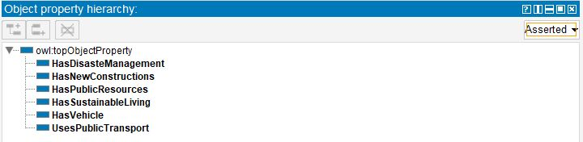
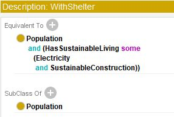
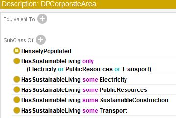
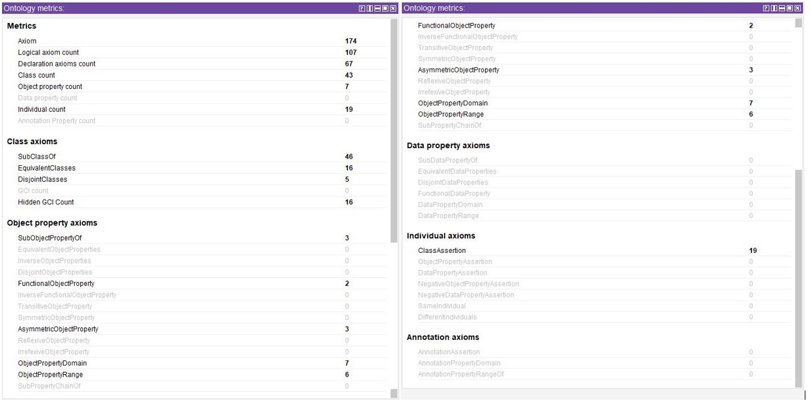

# IA301_SymbolicAI_Ontologies

Developing ontology about sustainable cities and Human Settlements SDG GOAL11

------------------------------- **Sustainable Cities Ontology** -------------------------------
> “make  cities  and  human  settlements  inclusive,  safe-resilient  and  sustainable.” 

## A. Basics

#### A.1 Ontology name
- Sustainable Cities and Human Settlements, v1.0

#### A.2 Ontology owner
- Sini SURESH
- Imad Eddine MAROUF
- Anne-Claire MARECHAL

#### A.3 Ontology license
- Creative Commons Attribution 3.0 (CC BY 3.0) 
----

#### A.4 Ontology URL

| https://github.com/IemProg/IA301_SymbolicAI_Ontologies/blob/main/Goal11.owl |

----

#### A.5 Ontology repository

| https://github.com/IemProg/IA301_SymbolicAI_Ontologies |

----

#### A.6 Methodological framework

The method we adopted in development of this Ontology is purely based on lecture notes and reference materials provided in the course.

|**Objective**| An ontology for the sustainable cities knowledge domain, in order to help urban planning |

|**Main classes**| Sustainibility, Regions, and Population |

|**Basic property**| Defining the basic relationships between classes and how they interact in a real-world environment |

|**Creation of the ontology**| Using Prote ́ge ́|

----

##  B. Motivation

#### B.1 Need
Cities are growing with unseen rate, providing better living conditions at the cost of nature. Which rises the worry, therefore many association are devoted for the aim to provide suitable plans for goverments to create smart, sustainable cities. One of them, is the Agenda2030 published by the UN containing 17 objectives. My team decided to work on GOAL11 "Make  cities  and  human  settlements  inclusive,  safe,resilient  and  sustainable.” Throughtout, this project we would like to build an ontology which is a recommendation model to help urban planning.

----

#### B.2 Objective:  
 
A recommendation model to help urban planning and ensure sustainability of cities and human settlements.

- This project is a recommendation model to help urban planning and ensure sustainability of cities and human settlements.
- This model ensures shelter for everyone in the city and also ensures that any new construction (including residential and industrial) happens only in the expandable regions of the city.
- This models projects that every mode of transportation is sustainable. 
- This model also recommends an urban system where disaster prone regions are a part of disaster management where community help/ disaster mitigation/ response and recovery teams are active and assigned.
- All the existing residential and industrial areas are provided with sustainable resources

----

#### B.3 Target Audience

The extension of this Ontology is expected to help Urban Planners and Disaster Management Team.

## C. Scope, requirements, development community

#### C.1 Scope and Coverage

- This ontology is intuitive,  and very limited as it is v1.0. This Ontology provides a potential model which satisfies all the criteria of sustainable living in cities.
- Cover all major aspects of sustainable city
	- Housing
	- Transportation
	- Energy 
	
----

#### C.2 Knowledge Acquisition Methodology

Knowledge was acquired by modeling the defined factors 

----

## D. Knowledge acquisition

#### D.1 Knowledge acquisition methodology
The knowledge materials for this Ontology is collected from:  
     - Lecture notes and reference materials provided in the course. 
     - Articles of UN about SDG Goals.
     - Literature articles regarding developing ontologies for sustainable cities.
     
#### D.2 Content selection

Made by the team member's on the basis of intuitive considerations and considering the appropriate required work-load.

----

## E. Ontology content

#### E.1 Knowledge Representation language

 OWL version 2

----

#### E.2 Development environment

Protégé

#### E.3 Ontology metrics

#### Identifier Generation Policy

- Identifiers, and class labels according to the domain knowledge.

----

#### Entity metadata policy

Each class minimally requires a textual definition, a label, a creator and an edit date.

----

#### Ontology relationships

| 
| |
| |

#### Testing
Main classes: 3, Total # of classes: 43, Object properties: 7, Axioms: 174 Provided in the report with screenshot.

| |
